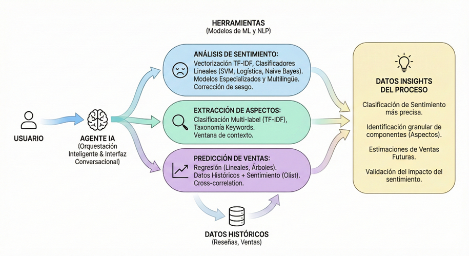
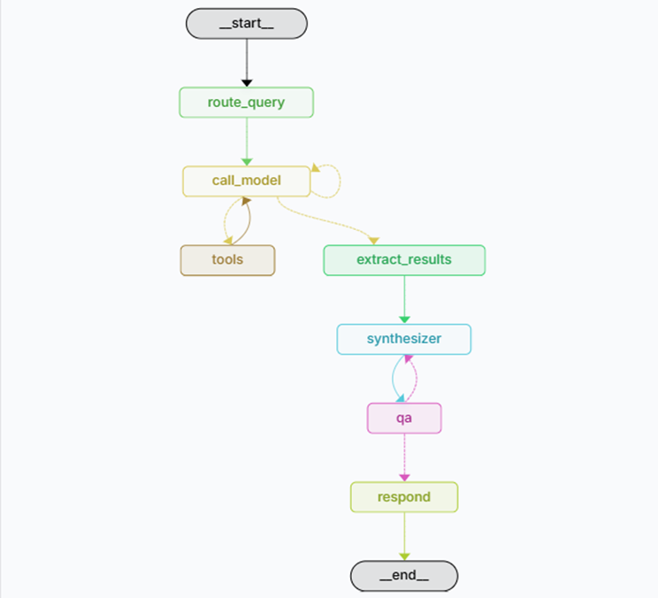

# TFM: Sistema Agentic de Análisis de Reseñas con LangGraph

## Visión General

Este proyecto implementa un **sistema agentic real** para análisis inteligente de reseñas y predicción de ventas. Utiliza **LangGraph** como motor de orquestación de agentes y **NLP/ML** como núcleo analítico.

### Diferenciador Clave

El LLM **NO** procesa ni agrega datasets masivos en contexto. En su lugar:

1. **Actúa como planificador/razonador**: inspecciona qué artefactos (features, agregados, modelos) ya existen
2. **Decide dinámicamente**: qué cálculos son necesarios para responder la pregunta del usuario
3. **Ejecuta tools deterministas**: que operan sobre storage estructurado (Parquet)
4. **Comunicación natural con el usuario**: toma las dudas del usuario y tiene el contexto necesarios para decidir y proceder en los casos de uso

Este enfoque permite:
-  Escalar a cientos de miles de reseñas sin saturar el contexto del LLM
-  Mantener reproducibilidad total
-  Demostrar valor agentic con rutas condicionales
-  Implementar lazy computation (calcular solo si no existe)
-  QA y evaluación trazable en LangSmith

---

## Arquitectura



---

## Estructura del Repositorio

```
tfm-agents/
|-- data/
|   |-- bronze/          # Datos crudos (JSONL, CSV)
|   |   |-- yelp/
|   |   |-- rese_esp/
|   |   +-- olist_ecommerce/
|   |-- silver/          # Datos limpios y normalizados (Parquet)
|   |-- gold/            # Features, agregados, métricas (Parquet)
|   +-- test/            # Datos de prueba
|       +-- es_annotated_reviews.csv  # Corpus anotado español (300 reviews)
|-- models/
|   |-- sentiment/       # Modelos de sentimiento entrenados (.joblib)
|   +-- aspects/         # Modelos de aspectos (.joblib, .json)
|-- docs/
|   +-- data_contracts.md
|-- notebooks/
|   |-- 01_eda_yelp.ipynb
|   |-- 02_eda_es.ipynb
|   |-- 03_eda_olist.ipynb
|   |-- 04_pruebas_fase3.ipynb
|   |-- 05_nlp_sentiment_models.ipynb   # Entrenamiento modelos sentimiento
|   +-- 06_nlp_aspect_extraction.ipynb  # Extraccion de aspectos
|-- src/
|   +-- tfm/
|       |-- config/      # Configuracion y settings
|       |-- schemas/     # Pydantic models (State, Request, Outputs)
|       |-- tools/       # Herramientas deterministas + NLP
|       |-- agents/      # Agentes LLM (router, synthesizer, qa)
|       +-- graphs/      # Grafo conversation_graph
|-- scripts/             # Scripts de utilidad
|-- tests/
|-- langgraph.json
|-- pyproject.toml
+-- README.md
```

---

## Grafo Principal: conversation_graph

El sistema utiliza un unico grafo (`conversation_graph`) que orquesta todo el flujo conversacional.

### Nodos del Grafo

| Nodo | Tipo | Responsabilidad |
|------|------|-----------------|
| `route_query` | Router (LLM) | Prepara contexto y mensajes para el modelo |
| `call_model` | LLM + Tools | Decide que herramientas invocar via `bind_tools` |
| `tools` | ToolNode | Ejecuta las herramientas seleccionadas (determinista) |
| `extract_results` | Procesador | Extrae resultados de tools para sintesis |
| `synthesizer` | LLM | Genera reporte estructurado (`InsightsReport`) |
| `qa` | LLM | Valida respuesta (schema, confidence, faithfulness) |
| `respond` | Procesador | Formatea respuesta final para el usuario |

### Flujo del Grafo



## Agentes (LLM-based)

| Agente | Archivo | Responsabilidad |
|--------|---------|-----------------|
| **Router** | `agents/router.py` | Decide qué herramientas invocar via `bind_tools` |
| **Insight Synthesizer** | `agents/insight_synthesizer.py` | Genera reporte estructurado de insights |
| **QA Evaluator** | `agents/qa_evaluator.py` | Checks deterministas + evaluación LLM de faithfulness/confidence |

### Arquitectura de Tool Binding

El sistema usa **tool binding** de LangChain para que el LLM descubra automáticamente las herramientas disponibles:

```python
# El LLM ve todas las herramientas y sus descripciones
llm_with_tools = llm.bind_tools([
    get_reviews_distribution,  # Distribución de ratings
    get_sales_by_month,        # Ventas por mes (Olist)
    get_sentiment_distribution, # Distribución de sentimiento NLP
    ...
])
```

Esto permite:
- **Descubrimiento dinámico**: El LLM "ve" qué herramientas existen
- **Extensibilidad**: Agregar una tool nueva = el LLM la puede usar automáticamente
- **Decisiones inteligentes**: El LLM decide basándose en las descripciones de cada tool

---

## Datasets

### 1. Yelp Academic Dataset (Inglés)
- Archivo: `yelp_academic_dataset_review.json` (JSONL)
- Campos clave: `review_id`, `business_id`, `stars`, `text`, `date`

### 2. Reseñas en Español
- Archivo: `reviews_dataframe_completo.csv`
- Campos clave: `review_id`, `product_id`, `stars`, `review_body`, `review_title`

### 3. Olist Brazilian E-commerce (Portugués)
- Múltiples CSV con órdenes, items, reviews, productos
- Incluye timestamps y precios
- Tabla de traducción de categorías (pt-en)

Ver detalles en: [`docs/data_contracts.md`](docs/data_contracts.md)

---

## Fases de Desarrollo

### Fase 1: EDA y Prototipos 
- [x] EDA Yelp: distribucion de stars, longitud de texto, fechas, usuarios
- [x] EDA ES: exploracion sin fecha, categorias
- [x] EDA Olist: relacion ventas-reviews, temporalidad
- [x] Prototipos de NLP basico en notebooks
- [x] Documentacion de conclusiones

### Fase 2: Tools Deterministas
- [x] Loaders y storage (bronze -> silver)
- [x] Profiling de datasets
- [x] Preprocesamiento: reviews, users, business

### Fase 3: Features y Agregaciones
- [x] Agregaciones (por stars, mes, categoría)
- [x] Análisis de reviews ambiguas
- [x] Correlaciones reviews-ventas (Olist)
- [x] Sentimiento VADER para inglés
- [x] Features gold layer

### Fase 4: Agentes y Grafos
- [x] Router con **tool binding**
- [x] Tools con decorador `@tool`
- [x] Conversation graph con flujo completo
- [x] Insight Synthesizer con LLM
- [x] QA Evaluator con checks determinísticos + LLM

### Fase 5: NLP y ML
- [x] Modelos de sentimiento TF-IDF + SVM/LogisticRegression
- [x] Modelos por idioma (yelp, es, olist) y modelo unificado
- [x] Extraccion de aspectos (calidad, precio, envio, servicio, etc.)
- [x] Sentimiento por aspecto con ventana de contexto
- [x] Corpus anotado ES (300 reviews) para validacion
- [x] Tools NLP integradas en el sistema agentic

### Fase 6: Prediccion de Ventas
- [x] Notebook 07: Exploracion y modelado de prediccion de ventas
- [x] Tools Correlacion sentimiento - ventas y reviews - ventas (Olist)
- [x] Entrenar modelo de prediccion (Linear Regression, Ridge, Random Forest, Gradient Boosting)
- [x] Crear tools `predict_monthly_sales`, `get_reviews_sales_monthly_correlation`, `get_sentiment_sales_monthly_correlation`
- [x] Integrar prediccion en conversation_graph
- [x] Metricas de evaluacion (MAE, RMSE, R2, MAPE)
- [x] Pruebas end-to-end en LangSmith

---

## Quickstart

```bash
# init
uv init

#  Añadir dependencias core
uv add langgraph langchain langchain-openai
uv add "langgraph-cli[inmem]" --dev
uv add polars pyarrow pydantic pydantic-settings

# Dependencias para notebooks de NLP/ML
uv add scikit-learn pandas numpy joblib
uv add matplotlib seaborn

# Dependencias para análisis de sentimiento
uv add vadersentiment

# Dependencias de desarrollo
uv add pytest jupyterlab ipykernel --dev

# Instalar el paquete local (IMPORTANTE)
uv pip install -e .

# Verificar instalación
uv run python -c "from tfm.config.settings import get_settings; print('OK')"

# Construir silver layer (primera vez)
uv run python scripts/build_silver.py --limit 10000

# Ejecutar LangGraph Studio
uv run langgraph dev
```

### Instalacion rapida para notebooks de NLP

Si solo necesitas ejecutar los notebooks `05_nlp_sentiment_models.ipynb` y `06_nlp_aspect_extraction.ipynb`:

```bash
# Paquetes mínimos requeridos para notebooks NLP/ML
uv add scikit-learn pandas numpy matplotlib seaborn joblib

# Verificar instalacion
uv run python -c "from sklearn.feature_extraction.text import TfidfVectorizer; print('sklearn OK')"
```

### Notebooks de NLP/ML

| Notebook | Descripcion | Output |
|----------|-------------|--------|
| `05_nlp_sentiment_models.ipynb` | Entrenamiento y comparacion de modelos de sentimiento | `models/sentiment/*.joblib` |
| `06_nlp_aspect_extraction.ipynb` | Extraccion de aspectos y sentimiento por aspecto | `models/aspects/*.joblib` |

**Ejecutar notebooks para entrenar modelos:**

```bash
# Abrir Jupyter Lab
uv run jupyter lab

# Navegar a notebooks/ y ejecutar:
# 1. 05_nlp_sentiment_models.ipynb (entrena modelos de sentimiento)
# 2. 06_nlp_aspect_extraction.ipynb (entrena modelos de aspectos)
```

**Modelos generados:**
- `models/sentiment/unified_svm_sentiment.joblib` - Modelo unificado (recomendado)
- `models/sentiment/yelp_svm_sentiment.joblib` - Especializado ingles
- `models/sentiment/es_logistic_sentiment.joblib` - Especializado espanol
- `models/sentiment/olist_svm_sentiment.joblib` - Especializado portugues
- `models/aspects/aspect_classifier_lr.joblib` - Clasificador multi-label de aspectos
- `models/aspects/aspect_taxonomy.json` - Taxonomia de aspectos multi-idioma

---

## Variables de Entorno

```
OPENAI_API_KEY=         # Requerido para LLM
LANGSMITH_API_KEY=      # Para trazabilidad
LANGSMITH_TRACING=true
LANGSMITH_PROJECT=tfm-agents
```

---

## Dependencias Principales

- `langgraph` - Orquestación de agentes
- `langchain` / `langchain-openai` - Integración LLM
- `polars` - Procesamiento de datos eficiente
- `pandas` / `numpy` - Análisis de datos y operaciones numéricas
- `pyarrow` - Soporte Parquet
- `pydantic` - Validación de esquemas
- `scikit-learn` - Machine Learning y métricas
- `vadersentiment` - Análisis de sentimiento (inglés)
- `matplotlib` / `seaborn` - Visualización
- `joblib` - Serialización de modelos

---

## Herramientas Disponibles (Tools)

### Tools de Análisis de Reviews

| Tool | Descripción | Datasets |
|------|-------------|----------|
| `get_reviews_distribution` | Distribución de ratings/estrellas | yelp, es, olist |
| `get_reviews_by_month` | Tendencia temporal de reviews | yelp, olist (NO es) |
| `get_ambiguous_reviews_analysis` | Análisis de reviews de 3 estrellas | yelp, es, olist |
| `get_text_length_analysis` | Análisis por longitud de texto | yelp, es, olist |

### Tools de Ventas y Prediccion (Solo Olist)

| Tool | Descripcion |
|------|-------------|
| `get_sales_by_month` | Ventas/ordenes por mes |
| `get_sales_by_category` | Ventas por categoria de producto |
| `get_reviews_sales_correlation_basic` | Correlacion basica reviews vs ventas (por orden) |
| `get_reviews_sales_monthly_correlation` | Correlacion mensual reviews vs ventas con significancia |
| `get_sentiment_sales_monthly_correlation` | Correlacion sentimiento NLP vs ventas |
| `predict_monthly_sales` | Predice ventas para un mes futuro |
| `get_prediction_model_info` | Estado y metricas del modelo de prediccion |

### Tools de Usuarios/Negocios

| Tool | Descripción |
|------|-------------|
| `get_user_stats` | Estadísticas de usuarios, top reviewers |
| `get_business_stats` | Estadísticas de negocios |

### Tools de Utilidad

| Tool | Descripción |
|------|-------------|
| `get_dataset_status` | Verifica si los datos silver existen |
| `build_dataset_silver` | Construye capa silver para un dataset |

### Tools de NLP (Modelos ML Entrenados)

| Tool | Descripción |
|------|-------------|
| `get_sentiment_distribution` | Distribución de sentimiento en dataset |
| `get_aspect_distribution` | Aspectos mencionados y su frecuencia |
| `get_ambiguous_reviews_sentiment` | Sentimiento real de reseñas de 3 estrellas |
| `analyze_sentiment` | Analiza sentimiento de texto individual |
| `analyze_review_complete` | Análisis completo de una reseña |
| `get_nlp_models_status` | Verifica modelos NLP disponibles |

**Filtros disponibles:**
- `year`: Filtrar por año (yelp, olist)
- `stars`: Filtrar por estrellas (1-5)
- `sentiment_filter`: Filtrar por sentimiento (positive/negative/neutral)

**Métricas de los modelos (F1 Score):**
- Yelp (SVM): 0.858
- ES (Logistic): 0.712
- Olist (SVM): 0.832
- Unified (SVM): 0.786

---

## Uso en LangGraph Studio

### Iniciar LangGraph Studio

```bash
cd tfm-agents

# Activar entorno y ejecutar
uv run langgraph dev
```

Esto abrira automaticamente el navegador en `http://127.0.0.1:2024` con LangGraph Studio.


### Input para el Grafo `conversation`

En LangGraph Studio, expande "Input" y configura los campos:

| Campo | Valor | Descripcion |
|-------|-------|-------------|
| `user_query` | Tu pregunta aqui | Pregunta en lenguaje natural en espanol |
| `current_dataset` | `yelp`, `es`, u `olist` | Dataset a consultar (requerido) |

**Ejemplo de Input:**

```json
{
  "user_query": "Tu pregunta aquí",
  "current_dataset": "yelp"
}
```

**Valores para `current_dataset`:** `"yelp"`, `"es"`, `"olist"`

### Casos de Uso para Probar


### Ejemplo Paso a Paso en Studio

1. **Seleccionar grafo**: Click en dropdown arriba, elegir `conversation`
2. **Expandir Input**: Click en la seccion "Input" a la izquierda
3. **Configurar campos**:
   - En `User Query`: escribir `"Cual es la distribucion de ratings en Yelp?"`
   - En `Current Dataset`: escribir `"yelp"`
4. **Click Submit**
5. **Observar flujo**: Ver como pasa por `router` - `aggregator` - `synthesizer` - `qa`
6. **Ver resultado**: El nodo final muestra `insights_report` con el resumen


```

## Tests

```bash
# Ejecutar todos los tests
uv run pytest

# Tests por módulo
uv run pytest tests/test_loaders.py -v
uv run pytest tests/test_preprocess.py -v
uv run pytest tests/test_features.py -v
uv run pytest tests/test_sentiment.py -v
uv run pytest tests/test_aggregations.py -v
uv run pytest tests/test_router.py -v
uv run pytest tests/test_graph_integration.py -v
```

### Verificación de Estado

```bash
# Ver estado de todas las capas
uv run python scripts/data_status.py

# Ver solo una capa específica
uv run python scripts/data_status.py --layer silver
uv run python scripts/data_status.py --layer gold

# Ver con más detalles (nombres de columnas)
uv run python scripts/data_status.py --verbose

# Verificar archivos bronze existen
uv run python -c "from tfm.tools import check_bronze_files; print(check_bronze_files())"

# Verificar estado silver layer
uv run python scripts/build_silver.py --check

# Verificar estado gold layer
uv run python scripts/build_gold.py --check

# Verificar grafo compila
uv run python -c "from tfm.graphs.conversation_graph import conversation_graph; print('OK')"
```

---

## Escenarios capas de almacenamiento

Esta seccion documenta los diferentes escenarios para bronze, silver y gold.

### Escenario 1: Solo Bronze (Primera Ejecución)

**Preparación:**
```bash
# Eliminar silver y gold si existen (para prueba limpia)
rm data/silver/*.parquet
rm data/gold/*.parquet

# Verificar que bronze existe
uv run python scripts/build_silver.py --check
```

**Comportamiento esperado:**
- El LLM intenta invocar `get_reviews_distribution`
- La tool detecta que silver no existe y retorna error con sugerencia
- El LLM puede invocar `build_dataset_silver` para construir los datos
- Luego re-intenta la consulta original

**Input en LangSmith:**
```json
{
  "user_query": "Cual es la distribucion de ratings?",
  "current_dataset": "olist"
}
```

### Escenario 2: Silver Existe, Gold No Existe

**Preparación:**
```bash
# Construir solo silver
uv run python scripts/build_silver.py --limit 1000 --overwrite

# Eliminar gold
rm data/gold/*.parquet
```

**Comportamiento esperado:**
- El LLM invoca directamente `get_sales_by_month` (para órdenes/ventas)
- La tool lee datos de silver y retorna resultados
- El Synthesizer genera el insight
- Gold solo se construye si se necesitan features NLP

**Input en LangSmith:**
```json
{
  "user_query": "Cual es la evolucion de ordenes por mes?",
  "current_dataset": "olist"
}
```

**Tool invocada:** `get_sales_by_month`

### Escenario 3: Silver y Gold Existen (Flujo Optimo)

**Preparacion:**
```bash
# Construir ambas capas
uv run python scripts/build_silver.py --limit 5000 --overwrite
uv run python scripts/build_gold.py --overwrite
```

**Comportamiento esperado:**
- Flujo directo sin construccion
- Lecturas rapidas desde Parquet
- Agregaciones se materializan en memoria

**Input en LangSmith:**
```json
{
  "user_query": "Cuantas reseñas hay por mes en 2021?",
  "current_dataset": "yelp"
}
```

### Escenario 4: Cargar Datos Completos (Produccion)

**Preparacion:**
```bash
uv run python scripts/build_silver.py --overwrite
uv run python scripts/build_gold.py --overwrite
```

### Escenario 5: Distribucion de Sentimiento NLP

**Preparacion (ejecutar notebooks primero):**
```bash
# Verificar modelos existen
ls models/sentiment/*.joblib

# Verificar via tool
uv run python -c "from tfm.tools.nlp_models import get_nlp_models_status; print(get_nlp_models_status.invoke({}))"
```

**Input:**
```json
{
  "user_query": "Cual es la distribucion de sentimiento?",
  "current_dataset": "olist"
}
```

**Respuesta esperada:**
- Total analizado: ~40.000 reseñas
- Distribucion: positive 63%, neutral 5%, negative 32%
- Sentimiento promedio: 0.32 (positivo)

**Tool invocada:** `get_sentiment_distribution`

### Escenario 6: Sentimiento de reseñas de 3 Estrellas

**Input:**
```json
{
  "user_query": "Las reseñas de 3 estrellas son mas positivas o negativas?",
  "current_dataset": "olist"
}
```

**Respuesta esperada:**
- Total reseñas de 3 estrellas: ~3,500
- Distribucion: positive 35%, neutral 19%, negative 46%
- Interpretacion: Tendencia NEGATIVA

**Tool invocada:** `get_ambiguous_reviews_sentiment`

### Escenario 7: Aspectos en reseñas Negativas

**Input:**
```json
{
  "user_query": "Cuales son los problemas mas mencionados en reseñas negativas?",
  "current_dataset": "yelp"
}
```

**Respuesta esperada:**
- Top aspectos: service (55%), product (37%), price (34%)
- Desglose de sentimiento por cada aspecto

**Tool invocada:** `get_aspect_distribution` con filtro sentiment=negative

### Escenario 8: Correlacion Sentimiento-Ventas

**Preparacion (ejecutar notebook 07 primero):**
```bash
# Verificar modelos de prediccion existen
ls models/prediction/*.joblib

# Verificar via tool
uv run python -c "from tfm.tools.prediction_models import get_prediction_model_status; print(get_prediction_model_status())"
```

**Input:**
```json
{
  "user_query": "El sentimiento de los clientes afecta las ventas?",
  "current_dataset": "olist"
}
```

**Respuesta esperada:**
- Correlacion sentimiento vs revenue: r=0.XX (significativa/no significativa)
- Interpretacion de la relacion
- Meses analizados

**Tool invocada:** `get_sentiment_sales_monthly_correlation`

### Escenario 9: Prediccion de Ventas

**Input:**
```json
{
  "user_query": "Cuanto se vendera en agosto de 2018?",
  "current_dataset": "olist"
}
```

**Respuesta esperada:**
- Prediccion: R$ X,XXX,XXX
- Modelo usado: Random Forest / Gradient Boosting
- Metricas del modelo (MAE, R2)
- Features utilizadas

**Tool invocada:** `predict_monthly_sales`

---

## Casos de Uso para Probar

### Casos Basicos (Agregaciones Simples)

| Pregunta | Dataset | Agregacion | Descripcion |
|----------|---------|------------|-------------|
| "Cual es la distribucion de ratings?" | yelp | `reviews_by_stars` | Conteo por estrellas 1-5 |
| "Cuantas reseñas hay por mes?" | olist | `reviews_by_month` | Tendencia temporal |
| "Cuales son los usuarios mas influyentes?" | yelp | `user_stats` | Top usuarios por influence_score |
| "Cuales son las ventas por mes?" | olist | `olist_sales` | Revenue mensual |
| "Analiza las reseñas de 3 estrellas" | yelp | `ambiguous_reviews` | Reviews ambiguas |

### Casos Avanzados (Requieren Gold o Multiples Agregaciones)

| Pregunta | Dataset | Agregaciones | Descripcion |
|----------|---------|--------------|-------------|
| "Cual es el sentimiento promedio y como se distribuye?" | yelp | `reviews_by_stars` + gold | Usa features de sentimiento |
| "Compara el sentimiento de reseñas largas vs cortas" | yelp | `text_length` | Analisis por longitud |
| "Cuales son las categorias con mas ventas?" | olist | `olist_by_category` | Top categorias |
| "Como correlacionan reviews y ventas?" | olist | `olist_reviews_sales` | Correlacion |
| "Estadisticas de negocios en Yelp" | yelp | `business_stats` | Metricas de negocios |

### Casos de Prediccion y Correlacion (Solo Olist)

| Pregunta | Tool | Descripcion |
|----------|------|-------------|
| "Cual es la correlacion entre reviews y ventas?" | `get_reviews_sales_monthly_correlation` | Correlacion mensual con significancia |
| "El sentimiento afecta las ventas?" | `get_sentiment_sales_monthly_correlation` | Correlacion sentimiento-ventas |
| "Predice las ventas de enero 2018" | `predict_monthly_sales` | Prediccion con modelo ML |
| "Cual es el modelo de prediccion?" | `get_prediction_model_info` | Estado y metricas del modelo |

**Ejemplo de correlacion:**
```json
{
  "user_query": "Como correlaciona el sentimiento con las ventas?",
  "current_dataset": "olist"
}
```

**Ejemplo de prediccion:**
```json
{
  "user_query": "Predice las ventas para julio de 2018",
  "current_dataset": "olist"
}
```

### Casos de Guardrails (Deben Rechazarse)

| Pregunta | Dataset | Error Esperado |
|----------|---------|----------------|
| "Cual es la tendencia por mes?" | es | "Dataset ES no tiene fechas" |
| "Cuales son las ventas?" | yelp | "Solo Olist tiene datos de ventas" |
| "hola" | - | "Query muy corta" |
| "Predice las ventas" | yelp | "Prediccion solo disponible para Olist" |

### Casos NLP sobre Datasets (Uso Principal)

| Pregunta | Dataset | Tool | Descripcion |
|----------|---------|------|-------------|
| "Cual es la distribucion de sentimiento?" | yelp | `get_sentiment_distribution` | % positivo/neutral/negativo |
| "Cuantas reseñas positivas hay?" | olist | `get_sentiment_distribution` | Conteo por sentimiento |
| "Cual es el sentimiento promedio?" | yelp | `get_sentiment_distribution` | Media de sentimiento |
| "Que porcentaje de reseñas son negativas?" | olist | `get_sentiment_distribution` | Distribucion |
| "Cual es el sentimiento de las reseñas de 3 estrellas?" | yelp | `get_ambiguous_reviews_sentiment` | Tendencia real |
| "Las reseñas ambiguas son mas positivas o negativas?" | olist | `get_ambiguous_reviews_sentiment` | Analisis ambiguas |
| "Cuales son los aspectos mas mencionados?" | yelp | `get_aspect_distribution` | Frecuencia de aspectos |
| "De que hablan las reseñas negativas?" | olist | `get_aspect_distribution` | Aspectos en negativas |
| "Que problemas mencionan las reseñas de 1 estrella?" | yelp | `get_aspect_distribution` | Aspectos por stars |

### Ejemplos de Inputs NLP

**Distribucion de sentimiento general:**
```json
{
  "user_query": "Cual es la distribucion de sentimiento?",
  "current_dataset": "olist"
}
```

**Sentimiento de reseñas de 3 estrellas:**
```json
{
  "user_query": "Las reseñas de 3 estrellas son mas positivas o negativas?",
  "current_dataset": "olist"
}
```

**Aspectos en reseñas negativas:**
```json
{
  "user_query": "Cuales son los problemas mas mencionados en reseñas negativas?",
  "current_dataset": "yelp"
}
```

**Analisis de reseña individual (uso secundario):**
```json
{
  "user_query": "Analiza esta reseña: 'Excelente producto, muy buena calidad'",
  "current_dataset": "es"
}
```

---

## Comandos de Preparacion de Datos

### Construir Silver Layer

```bash
# Todos los datasets (con limite para pruebas)
uv run python scripts/build_silver.py --limit 5000 --overwrite

# Dataset individual
uv run python scripts/build_silver.py --dataset yelp --limit 10000 --overwrite
uv run python scripts/build_silver.py --dataset es --limit 10000 --overwrite
uv run python scripts/build_silver.py --dataset olist --overwrite  # Olist no necesita limite

# Sin limite (datos completos)
uv run python scripts/build_silver.py --overwrite
```

### Construir Gold Layer (Features NLP)

```bash
# Todos los datasets
uv run python scripts/build_gold.py --overwrite

# Dataset individual
uv run python scripts/build_gold.py --dataset yelp --overwrite
```

### Limpiar Datos (Para Pruebas)

```bash
# Limpiar silver (forzar reconstruccion)
rm data/silver/yelp_reviews.parquet
rm data/silver/es_reviews.parquet
rm data/silver/olist_*.parquet

# Limpiar gold (forzar reconstruccion features)
rm data/gold/*.parquet

# Limpiar warehouse DuckDB
rm warehouse/tfm.duckdb
```
---

## Cómo Agregar Nuevas Tools

El sistema usa **tool binding** lo que hace muy fácil agregar nuevas herramientas:

### 1. Crear la Tool en `src/tfm/tools/analysis_tools.py`

```python
from langchain_core.tools import tool

@tool
def mi_nueva_herramienta(dataset: Literal["yelp", "es", "olist"]) -> Dict[str, Any]:
    """
    Descripción clara de lo que hace esta herramienta.
    
    Usa esta herramienta cuando el usuario pregunte sobre:
    - Caso de uso 1
    - Caso de uso 2
    
    DISPONIBLE PARA: yelp, olist (lista los datasets soportados)
    
    Args:
        dataset: El dataset a analizar
        parametro: Descripción del parámetro
        
    Returns:
        Diccionario con resultados
    """
    # Implementación
    return {"resultado": "datos"}
```

### 2. Agregar a `get_all_tools()`

```python
def get_all_tools() -> List:
    return [
        # ... tools existentes ...
        mi_nueva_herramienta,  # Agregar aquí
    ]
```

### 3. El LLM la descubre automáticamente

No hay que modificar el Router ni el grafo. El LLM verá la nueva herramienta y podrá usarla basándose en su descripción.

---

## Verificacion de Tools NLP

### Verificar modelos cargados

```bash
uv run python -c "from tfm.tools.nlp_models import get_nlp_models_status; print(get_nlp_models_status.invoke({}))"
```

### Probar distribucion de sentimiento (dataset completo)

```bash
uv run python -c "from tfm.tools.nlp_models import get_sentiment_distribution; import json; print(json.dumps(get_sentiment_distribution.invoke({'dataset': 'olist'}), indent=2))"
```

### Probar sentimiento de reseñas ambiguas

```bash
uv run python -c "from tfm.tools.nlp_models import get_ambiguous_reviews_sentiment; import json; print(json.dumps(get_ambiguous_reviews_sentiment.invoke({'dataset': 'yelp'}), indent=2))"
```

### Probar distribucion de aspectos

```bash
uv run python -c "from tfm.tools.nlp_models import get_aspect_distribution; import json; print(json.dumps(get_aspect_distribution.invoke({'dataset': 'yelp', 'sentiment_filter': 'negative'}), indent=2))"
```

### Probar analisis de reseña individual

```bash
uv run python -c "from tfm.tools.nlp_models import analyze_sentiment; print(analyze_sentiment.invoke({'text': 'Excelente producto', 'model': 'unified'}))"
```

### Listar todas las tools disponibles

```bash
uv run python -c "from tfm.tools.analysis_tools import get_all_tools; [print(t.name) for t in get_all_tools()]"
```

---

## Troubleshooting

### Error: "No module named 'tfm'"

Ejecutar:
```bash
uv pip install -e .
```

### Error: Silver layer no existe

Ejecutar:
```bash
uv run python scripts/build_silver.py --limit 10000
```

### LangGraph Studio no conecta

1. Verificar que `.env` tenga `OPENAI_API_KEY`
2. Verificar que el grafo compile: `uv run python -c "from tfm.graphs.conversation_graph import conversation_graph; print('OK')"`

---

## Licencia

Proyecto académico - TFM Big Data / Data Science

---

## Referencias

- [LangGraph Documentation](https://langchain-ai.github.io/langgraph/)
- [LangSmith](https://smith.langchain.com/)
- [Yelp Dataset](https://www.yelp.com/dataset)
- [Olist Dataset](https://www.kaggle.com/olistbr/brazilian-ecommerce)
